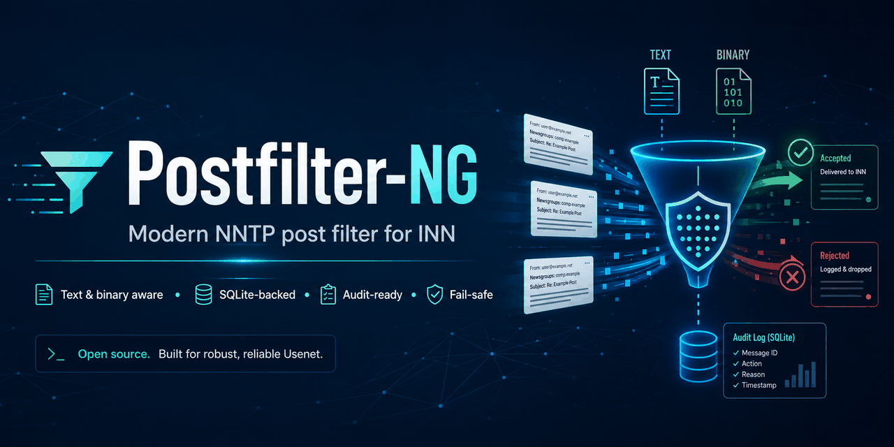

<p align="center">
  <a href="https://github.com/infybofh/postfilter-ng">
    
  </a>
</p>

<p align="center">
  <a href="https://github.com/infybofh/postfilter-ng/releases"></a>
  <a href="LICENSE"></a>
  <a href="https://github.com/infybofh/postfilter-ng/issues"></a>
  <a href="https://github.com/infybofh/postfilter-ng/actions/workflows/tests.yml"></a>
  <a href="https://www.perl.org/"></a>
  <a href="https://www.eyrie.org/~eagle/software/inn/"></a>
  <a href="https://calver.org/"></a>
</p>

# Postfilter-NG

Postfilter-NG is a Perl posting filter for the INN `nnrpd` service. It validates
articles before acceptance, applies text and binary policies, records searchable
audit events in SQLite, and supports staged deployment through audit mode.

> **Version:** `2026.07.5-rc4`  
> **Status:** **Release candidate**  
> **Runtime:** [Perl](https://www.perl.org/) 5.38 or newer and
> [INN](https://www.eyrie.org/~eagle/software/inn/) 2.x  
> **Default policy:** `audit`

## Highlights

- Independent text and binary article profiles.
- `text-only` and `mixed` reader modes.
- Immediate rejection of text/binary mixed crossposts.
- Configurable body, header, total-size and scan limits for each article type.
- yEnc and uuencode policy separated by article type.
- Strict MIME attachment detection for text groups.
- Bounded Base64 detection with PGP, GnuPG, S/MIME and certificate exceptions.
- SQLite WAL audit history with indexed long-term queries.
- Stable symbolic `PF-*` reason codes and numeric compatibility codes.
- Trusted profiles with selectable check bypasses.
- DNSBL, URIBL, SURBL and TOR checks with caching, provider cooldown and a hard shared DNS deadline.
- Last-known-good configuration snapshots and per-rule validation.
- Static HTML statistics, saved-article diagnostics and `postfilterctl` tooling.
- Transactional installation with persistent INN-discovered runtime paths, portable Perl entry points and independent cryptographic keys generated from `/dev/urandom`.

## Supported reader modes

### Text-only

```toml
[article_types]
mode = "text-only"
```

Every post uses the text profile. The text profile rejects yEnc, uuencode,
email-style attachments, forbidden MIME media and large unlabelled Base64
payloads according to its configured thresholds.

### Mixed text and binary

```toml
[article_types]
mode = "mixed"
```

Articles posted only to configured binary groups use the binary profile.
Articles posted only to other groups use the text profile. A post spanning both
group classes is rejected with `PF-GROUP-095` before trusted-profile bypasses.

The binary group glob list, both size profiles, skipped checks and rejection-save
rules are fully configurable. See
[`docs/TEXT-AND-BINARY.md`](docs/TEXT-AND-BINARY.md).

## Requirements

Runtime dependencies:

- [`TOML::Tiny`](https://metacpan.org/pod/TOML::Tiny)
- [`DBI`](https://metacpan.org/pod/DBI)
- [`DBD::SQLite`](https://metacpan.org/pod/DBD::SQLite)
- [`Net::DNS`](https://metacpan.org/pod/Net::DNS)
- [`Date::Parse`](https://metacpan.org/pod/Date::Parse) from TimeDate
- [`Crypt::Mode::CBC`](https://metacpan.org/pod/Crypt::Mode::CBC) from CryptX

Development tools:

- [`Perl::Tidy`](https://metacpan.org/pod/Perl::Tidy)
- [`Perl::Critic`](https://metacpan.org/pod/Perl::Critic)
- [`Test::More`](https://metacpan.org/pod/Test::More)

The installer verifies runtime dependencies before activation.

## Start here

1. Read [`docs/INSTALL.md`](docs/INSTALL.md).
2. Review every setting in [`conf/postfilter.toml`](conf/postfilter.toml).
3. Select `text-only` or `mixed` operation using
   [`docs/TEXT-AND-BINARY.md`](docs/TEXT-AND-BINARY.md).
4. Review the MIME and Base64 policy in
   [`docs/TEXT-MIME-ATTACHMENTS.md`](docs/TEXT-MIME-ATTACHMENTS.md).
5. Run the configuration and regression tests.
6. Deploy with `policy.mode = "audit"` and inspect real traffic before enabling
   enforcement.

## Quick verification

From the extracted project directory:

```sh
perl -Ilib -c postfilter
perl -Ilib -c bin/postfilterctl
perl -Ilib -c installer/install-postfilter
./tests/run-tests
sha256sum -c SHA256SUMS
```

Check the effective configuration:

```sh
bin/postfilterctl check-config \
  --config ./conf/postfilter.toml \
  --state-dir ./var-test
```

Inspect an article offline:

```sh
bin/postfilterctl explain \
  --config ./conf/postfilter.toml \
  --state-dir ./var-test \
  --hook-stage raw-client \
  sample.post
```

## Installation

The installer discovers INN paths through `innconfval` and accepts explicit
path overrides for Debian, Ubuntu, FreeBSD, OpenBSD and other supported Unix-like
systems. It writes the selected configuration and state paths into the installed
Perl module tree, pins installed command shebangs to the Perl interpreter used for
setup, and validates those defaults without temporary environment variables.

```sh
sudo installer/install-postfilter --dry-run
sudo installer/install-postfilter
```

The installer stages the filter entry point without changing the active INN
hook:

```text
<pathfilter>/filter_nnrpd.pl.ng -> <prefix>/postfilter
```

After configuration tests and audit review, the newsmaster backs up any existing
`filter_nnrpd.pl` and renames the staged link to `filter_nnrpd.pl`.  Manual
installations create the same symlink explicitly.  Detailed activation and
rollback commands are in [`docs/INSTALL.md`](docs/INSTALL.md).

The setup creates all state directories, the SQLite schema and four separate
512-bit keys for TOR headers, header pseudonyms, HTML-report identities and
SQLite identity protection. Configuration validation and database creation run as the configured INN account; runtime state is installed as `news:news` by default. Configuration and keys remain `root:news` and read-only to the runtime account.

Upgrade, rollback and custom-path examples are documented in
[`docs/INSTALL.md`](docs/INSTALL.md).

Before activation, test the hook with the same `do`-style loading used by INN:

```sh
PF="$(innconfval pathfilter)"
sudo -u news perl -e '
    my $file = shift;
    my $loaded = do $file;
    die "Perl load error: $@" if $@;
    die "Operating-system error: $!" unless defined $loaded;
    die "Filter returned false\n" unless $loaded;
    die "filter_post() is not defined\n" unless defined &filter_post;
    print "Postfilter-NG hook load OK\n";
' "$PF/filter_nnrpd.pl.ng"
```

`ctlinnd reload filter.perl` applies to `filter_innd.pl`, not to this nnrpd
posting hook. Activate Postfilter-NG for new reader processes or restart the
local nnrpd/INN service according to the site layout.

## Audit and administration

`postfilterctl` provides configuration checks, article inspection, database
queries, reports, backup, rule testing, saved-article inspection and explicit
purge operations.

```sh
postfilterctl stats 24
postfilterctl query --article-type text --hours 24
postfilterctl query --article-type binary --reason PF-BODY-102
postfilterctl report-generate
postfilterctl backup /secure/backups/postfilter.sqlite3
```

Article events and rule hits have no automatic expiry. Deletion requires an
explicit `postfilterctl purge ... --confirm` command and creates an
administrative audit event.

## Project layout

- `postfilter` — INN Perl hook target; the installer stages `filter_nnrpd.pl.ng` for review.
- `lib/Postfilter/` — engine, context, checks, storage, reporting and utilities.
- `conf/` — canonical TOML configuration and local custom-rule module.
- `examples/` — focused configurations, article fixtures and audit-first Cleanfeed-NG local-hook examples.
- `bin/postfilterctl` — administration command.
- `installer/install-postfilter` — installation, upgrade and rollback tool.
- `migrations/` — SQLite schema and upgrade migrations.
- `packaging/` — optional systemd report service and timer.
- `share/` — Public Suffix data and report assets.
- `tests/` — regression, policy, security and concurrency tests.
- `docs/` — installation, architecture, configuration, security and references.

## Cleanfeed-NG companion hooks

[`examples/cleanfeed-local-hooks/`](examples/cleanfeed-local-hooks/) contains
complete, disabled-by-policy local-hook examples for Cleanfeed-NG. The pack
includes adapted historical signatures from Steve Crook's public sample and
newer composite rules. It defaults to save-and-allow audit behaviour and is not
loaded by Postfilter-NG.

## Documentation

- [`docs/INSTALL.md`](docs/INSTALL.md) — installation, upgrade and rollback.
- [`docs/CONFIGURATION.md`](docs/CONFIGURATION.md) — configuration loading and policy semantics.
- [`docs/TEXT-AND-BINARY.md`](docs/TEXT-AND-BINARY.md) — article classification and independent profiles.
- [`docs/TEXT-MIME-ATTACHMENTS.md`](docs/TEXT-MIME-ATTACHMENTS.md) — MIME, Base64 and cryptographic-material handling.
- [`docs/ERROR-CODES.md`](docs/ERROR-CODES.md) — symbolic and numeric result codes.
- [`docs/FUNCTION-REFERENCE.md`](docs/FUNCTION-REFERENCE.md) — documented Perl functions.
- [`docs/MIGRATION.md`](docs/MIGRATION.md) — migration from Postfilter 0.9.x configurations.
- [`docs/SECURITY.md`](docs/SECURITY.md) — keys, identity storage and threat boundaries.
- [`docs/ARCHITECTURE.md`](docs/ARCHITECTURE.md) — process model and filtering pipeline.

## Versioning

Postfilter-NG uses [Calendar Versioning](https://calver.org/):

```text
YYYY.MM.patch-stageN
```

Examples:

```text
2026.07.5-rc4
2026.07.5
```

Release candidates use `-rcN`. Stable releases omit the stage suffix. Published
archives and Git tags use the same version string.

## Contributing

Bug reports, false-positive reports, performance measurements, documentation
changes, tests and code contributions are welcome. Include the exact version,
relevant `PF-*` code, sanitized log lines, configuration context and enough
article structure to reproduce the result.

Read [`CONTRIBUTING.md`](CONTRIBUTING.md) before opening a pull request.

## Security

Report security issues through the repository's
[private security advisory form](https://github.com/infybofh/postfilter-ng/security/advisories/new).
Do not publish sensitive article data, keys, authentication material or private
server logs in a public issue.

See [`SECURITY.md`](SECURITY.md) and [`docs/SECURITY.md`](docs/SECURITY.md).

## Credits

Postfilter-NG preserves the copyright and license notices from Paolo Amoroso's
Postfilter project. The current implementation and configuration are maintained
as the Postfilter-NG project.

## License

Distributed under the BSD license included in [`LICENSE`](LICENSE).
